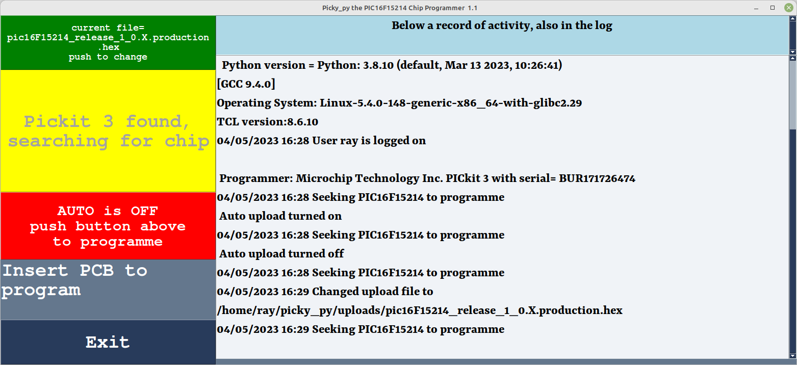

# picky-py
 Python GUI using Pickit 3 to program PIC16F15214
 This is a simple program to offer a GUI, based on PySimpleGUI, running on Linux, to premit simple programming of a Microchip PIC16F15214 on a PICKIT3 programmer.
 The program uses [pk2cmd minus](http://kair.us/projects/pickitminus/) as the command line control of the pickit 3.
 
 ## Background
 
 We use linux in production not MS Windows. The official Microchip way of programming the PIC16F15 range of microprocessors is to use a SNAP or Pickit 4 together with MPLAB IPE (note not IDE). We experimented with that, but it is just too complex for the staff we use to program - too many steps, obscure error messages etc. Thus we decided to switch to a home-grown program and use a command line utility, also provided by MPLAB (IPECMD) driven from our program, still driving a SNAP/Pickit4. The command line utility works, well sort-of. It is written in Java. The Linux version can only program one chip per program launch. It took 17 seconds to launch and program the chip. We were hoping for one second per chip.  The MS Windows version has a "permanently running" version - obviously someone decided that 17 seconds was unacceptable - except on Linux.

 The previous version of Pickit (version 3) had a much faster command line option (i.e. not written in Java) but Microchip does not support programming pic16F15 on the pickit 3. The microcode loaded into the pickit3 as provided by Microchip does not support PIC16F15 (and many other recent chips). Open source to the rescue. Various people have enhanced both the microcode and the PK2CMD program to support more recent chips but only for the pickit 3, SNAP and Pickit 4 are driven by secret programs. Pickit 3 programmers are available from other suppliers and the combination of Pickit 3 and pk2cmd minus is reliable and fast (around 3 seconds to load our small program).
 
## Design goals

The main design goal is to enable an operator to program chips very quickly and with a minimum of training. The program tries very hard to identify problems (such as not plugging in the programmer, or plugging in the wrong one) in order to give simple error messages. Setting up the program in the first place, on the other hand, is not automated. It is assumed that one person will be working at any one time on one linux system. Use another computer if two programmers are needed. The program is run under normal end-user privileges. It has a fixed directory structure with fixed except for the directory containing the .hex files which are named on the program's invocation command line.

A comprehensive log is written during the chip programming. It is not rotated neither is it cleared. Some manual housekeeping will be required for intensive use of the package.
 
## Modified packages

 In addition to pk2cmd which is used unchanged from the supplied appimage, we use a much-butchered version of [lsusb](https://github.com/gregkh/usbutils/blob/master/lsusb.py.in) to detect the existance of the pickit 3 programmer. This is renamed Pickit3detect.py.
 
# The program

The GUI of Picky-py is shown below. The right hand side is a log. Simply reduce the size of the window if you don't want to see it. All the action is on the left hand side. The top button allows selection between .hex files in the ~/"uploads" directory. The name of that directory is the string (no spaces) of the product being programmed. If there is only one .hex file in there, that is chosen automatically. The second button down is used, if in manual mode and a chip is present, to push to program the chip. If there is no PIC it will announce what the program is doing to find one. Below that is a selector button which puts the program in manual or auto mode. In manual, the user has to press a button to program the chip. In automatic, as soon as the computer detects a chip, it will program it. The latter is the fastest means of programming but the chip must be held stable on the pogo pins or the programming will fail. The final window is an announcement window only. Exit exits the program.

## Design of the program

[PySimpleGUI](https://www.pysimplegui.org) was chosen to implement the gui because it is a relatively simple application. PySimpleGUI is an event driven program with timeouts to permit background processing; ideal for this application which has no hard real-time deadlines. There is some flexibility in the program to change it's visual characteristics by changing (with care) the configuration JSON file. Perhaps more could be done but....

# The programmer hardware

Pickit 2 and 3 are no longer sold by Microchip. There are several different clones available in the marketplace. Two similar ones have been tested, one labelled Pickit 3 and the other Pickit 3.5+ - both work. However, they do not work out of the box. They must be configured first. This has only been done on MS Windows using the Pickit 2 GUI Programmer (from http://kair.us/projects/pickitminus/) and Pickit 3 Programmer from Microchip archive.  Run either program, plug in the pickit. Then use "tools" and "download the PICkit operating system" and wait. The programmer should then be set up for linux to identify it in the usb device tree. picky-py searches for it in the usb device tree and then verifies that it is accessible using pk2cmd.

# Installing picky_py

It can only be installed one user at a time and that user must be the only one using it at any particular time on one Linux machine i.e. multiple instances will not function.
 The fictional product called "Flicker" and user "user" is used to illustrate the contents:

## Create directories and install the files.

Create the picky_py directory. Initially the following files must exist:
<code>
drwxrwxr-x 2  user user   Flicker                       
-rwxr--r-- 1  user user   pickit3detect.py      
-rwxr--r-- 1  user user   picky_py1_1.py        
-rwxr--r-- 1  user user   picky_py.json         
-rwxr--r-- 1  user user   pk2cmd-x86_64.AppImage
</code>
Flicker is the directory which must contain at least one .hex file to program the Flicker product.  
pickit3detect.py is a library used to locate the pickit3 in the usb device chain.   
picky_py1_1.py is the main program (version at the time of writing)    
picky_py.json is a commented json file containing some modifyable strings.   
pk2cmd-x86_64.AppImage is where the function to drive the Pickit3 is to be found.   

## Create launch Icon and install

(this works for Kubuntu, your mileage may vary): Create a 32 by 32 pixel image. The example file in the repository was
created with Inkscape, exported as 32 by 32 pixel .png file and converted to xpm on the web by an online image convertor.
Place the icons in the normal location for shared icons (replacing "Flicker" with your product name):
<code>
sudo cp Flicker.xpm /usr/share/icons/Flicker.xpm
sudo chmod a+r /usr/share/icons/Flicker.xpm
</code>

## Edit launch file and place on desktop

Edit Flicker.desktop to a file yourproduct.desktop replacing instances of "Flicker" in the file with yourproduct.

Place the file on the users desktop. All being well your icon should appear on the desktop. Do not click on it yet.

## Set up Python

Ensure that typing "python" in a terminal window yields something like:
<code>
 Python 3.8.10 (default, May 26 2023, 14:05:08) 
[GCC 9.4.0] on linux
Type "help", "copyright", "credits" or "license" for more information.
/>/>/> 
</code>
The version of Python must be higher than 3.7. Type "exit()<cr>" to escape from Python.

Picky_py uses a number of python modules which may not be installed by default in your Python environment.
 In order to test this, open a command window, cd to picky_py directory and run Picky_py thus:
 <code>
 ./Picky_py1_1.py yourproduct
 </code>
 That will tell you which modules are missing from your environment. Normally using "pip modulename" to install (note NOT Sudo).
 
 ## Set up to allow user to access the Pickit3
 
 The file "60-pickit.rules" are two udev rules to change the permissions of the Pickit3 (and pickit2) devices.
 Install them as follows:

## 

